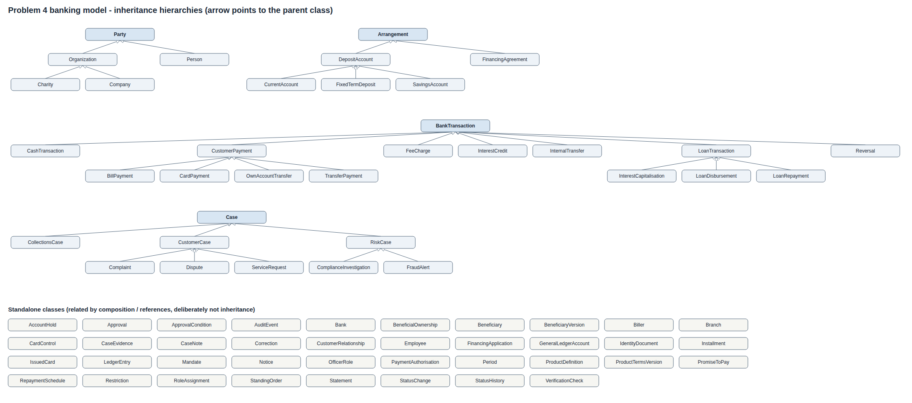
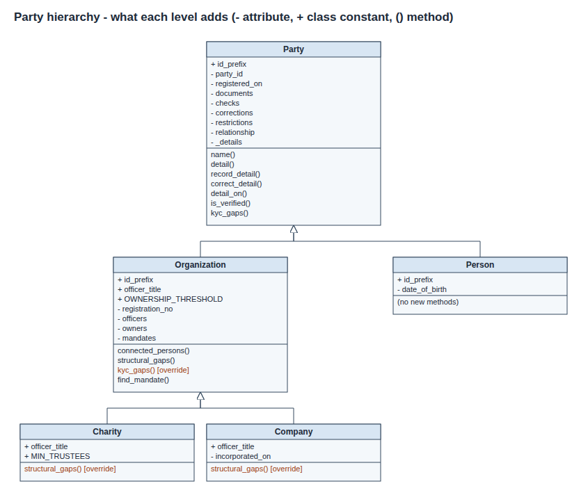
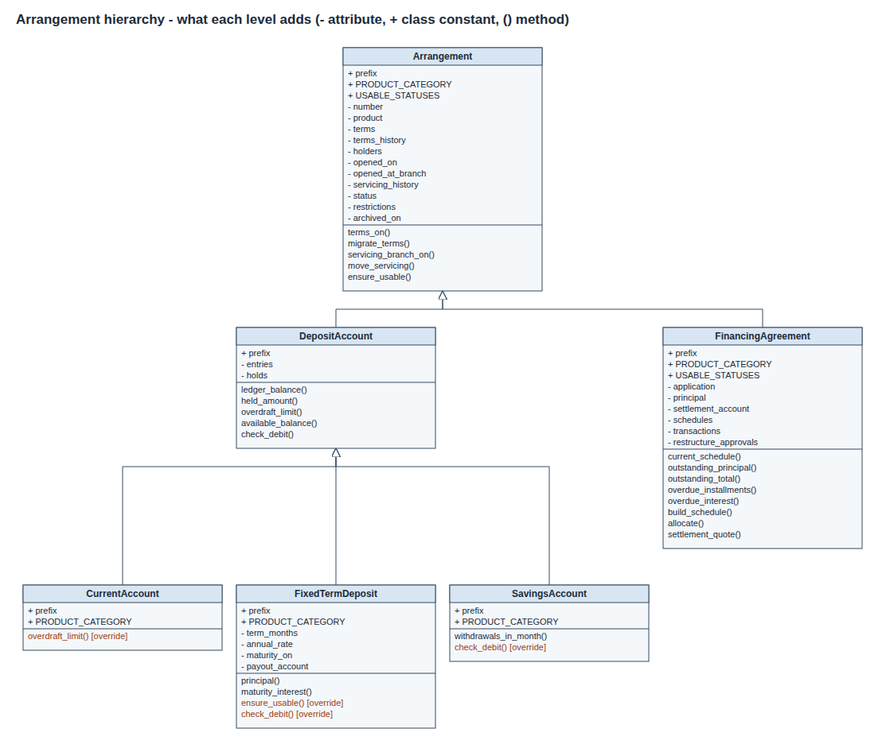
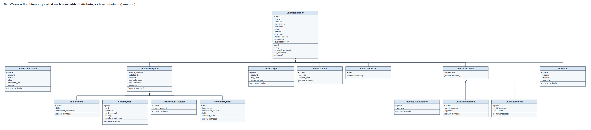
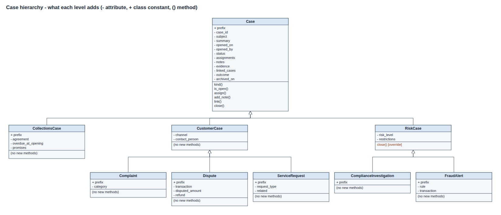
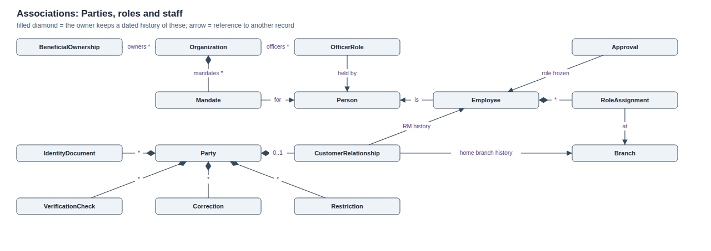
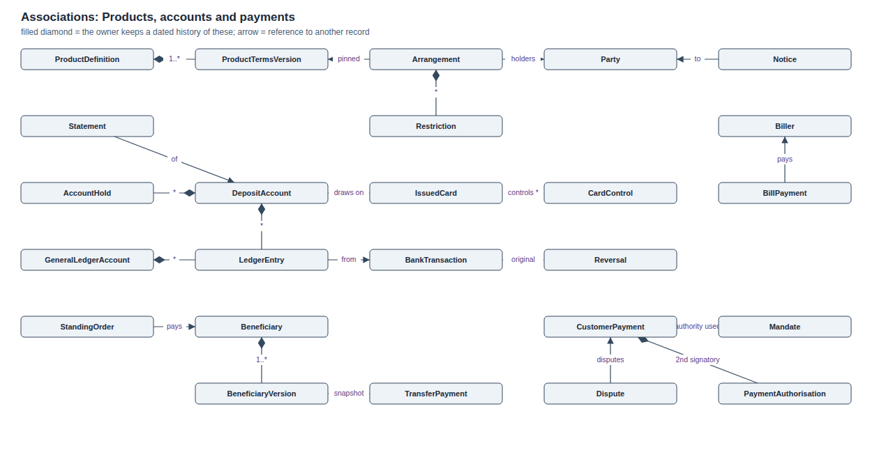
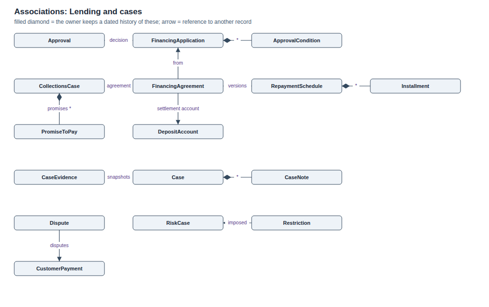

# Problem 4: Commercial Banking, Lending, Payments and Compliance

**Design report and implementation guide** (OOP project, assessed concepts: classes and inheritance)

| | |
|---|---|
| Prepared by | ______________________________ |
| Roll number | ______________________________ |
| Course and instructor | ______________________________ |

The whole implementation is one file, `banking_system.py` (Python 3.9+, standard library only). It contains the domain model, a seeded demonstration of 16 scenarios, 60 automated tests and generators for the class and UML diagrams.

```
python banking_system.py              # run the seeded demonstration
python banking_system.py --test       # run the 60 automated tests
python banking_system.py --classes    # print the inheritance tree and the counts
python banking_system.py --diagram docs   # regenerate every diagram (SVG) from the code
```

| Required submission item (brief, Problem 4) | Where |
|---|---|
| 1. Domain research summary, sources and terminology | Section 1 |
| 2. Assumptions | Section 2 (A1 to A36) |
| 3. Requirements interpretation | Section 3; 3.1 answers the brief's eight open questions; 3.2 maps every participant, research area and scope item of the brief to the model |
| 4. Class diagram | Section 4: overview, four UML hierarchy diagrams, three association diagrams (`docs/*.png`) |
| 5. Implementation with at least 30 classes and 30 operations | Section 5; `banking_system.py` (73 domain classes, 96 operations, 78 of them state-changing commands) |
| 6. Explanation of every inheritance relationship | Section 6 |
| 7. At least three tempting inheritances rejected | Section 7 (twelve given) |
| 8. Seeded demonstration | Section 8; `docs/demo_output.txt` |
| 9. At least five complex scenarios | Section 9 (sixteen given) |
| 10. Limitations and scaling | Section 10 |

---

## 1. Domain research summary

### Sources consulted

1. FATF, *International Standards on Combating Money Laundering and the Financing of Terrorism* (the FATF Recommendations), especially Recommendation 10 (customer due diligence) and Recommendations 24 and 25 (beneficial ownership of legal persons and arrangements).
2. State Bank of Pakistan, *AML/CFT/CPF Regulations* for banks and DFIs, for local customer due-diligence and beneficial-owner practice.
3. Basel Committee on Banking Supervision, *Sound management of risks related to money laundering and financing of terrorism*.
4. ISO 20022 payment message concepts (payment initiation and status reporting), for the idea that a payment moves through statuses rather than simply "succeeding".
5. Visa and Mastercard public dispute-resolution overviews, for the chargeback and dispute lifecycle.
6. IFRS 9 guidance on modification of financial assets, for how a restructured loan relates to the original agreement.
7. BIAN (Banking Industry Architecture Network) service landscape, for the separation between a product directory and a customer's product agreement.
8. Martin Fowler, *Analysis Patterns* and his "Temporal Patterns" essays, for the Party/role separation and effective-dated records.

### Key terminology learned

| Term | Meaning, and how it shaped the model |
|---|---|
| KYC / CDD | Verifying who a customer is before a relationship starts. Modelled as `IdentityDocument` + `VerificationCheck`, checked *as of a date*, so a document that expires during onboarding blocks it. |
| Beneficial owner (UBO) | A natural person who ultimately owns or controls an organisation (commonly 25% or more). Must also be verified. `BeneficialOwnership`. |
| Mandate | The authority an organisation gives a person to operate its accounts, often with limits. Separate from being a director. `Mandate` with a validity `Period`. |
| Dual control (maker-checker) | Payments above a threshold need a second authorised signatory who is not the initiator. `PaymentAuthorisation`. |
| Delegated credit authority | Each credit role may approve financing only up to a limit; larger amounts go to a higher authority. `Bank.CREDIT_LIMITS`, checked in `decide_application`. |
| Double entry, trial balance | Every posting has equal and opposite legs, so all balances in the bank sum to zero. Customer accounts balance against the bank's own `GeneralLedgerAccount`s (vault cash, clearing, income, receivables). |
| Ledger vs available balance | Ledger balance = sum of posted entries. Available = ledger - holds + overdraft. A held payment reduces the available balance without posting. |
| Hold | Funds reserved but not yet debited (`AccountHold`). |
| Posting | Writing an immutable entry to the ledger (`LedgerEntry`). Balances are derived, never stored. |
| Reversal / chargeback | Undoing a posted transaction by posting an equal and opposite one; the original remains. `Reversal`. |
| Standing order | A customer's recurring payment instruction. Authority is given once, when the instruction is created. |
| Conditions precedent | Requirements that must be met before approved financing can be disbursed. `ApprovalCondition`. |
| Amortisation schedule | The installment plan of principal and interest. `RepaymentSchedule` + `Installment`. |
| Arrears / DPD | Installments past due; they trigger collections. `CollectionsCase`. |
| Restructuring | Changing a loan's terms (tenor, rate) after default risk appears; overdue interest may be capitalised. A new schedule version, never an edit. |
| Service request | A routine customer instruction (block a card, request a statement), distinct from a complaint. `ServiceRequest`. |
| Product vs arrangement | The bank's product definition (what it sells) is different from a customer's instance of it (what the customer holds). |
| Sole trader | An individual trading under a business name with no separate legal personality; the person is liable. A `Person` in the `SOLE_TRADER` segment with a recorded trading name. |
| High-value (private banking) customer and EDD | Enhanced due diligence: higher-risk or high-value relationships also need the source of wealth evidenced. The `PRIVATE` segment requires a verified `SOURCE_OF_WEALTH` document. |
| Fixed-term deposit | Money placed for a fixed term at a fixed rate; paid out with interest at maturity, or broken early with interest forfeited and a penalty. `FixedTermDeposit`. |
| Card controls | Usage switches set by the cardholder or card operations (online, international, cash, merchant category). `CardControl`, with a validity period. |
| Biller / bill payment | An organisation the bank collects payments for (utility, telecom, tax). `Biller`, `BillPayment` with the customer's consumer reference. |
| Promise to pay | A collections outcome: the customer commits to pay an amount by a date; later marked kept or broken. `PromiseToPay`. |
| Record retention | Financial records must be kept for years after the relationship or product ends; "deletion" becomes archiving. `archive_record`, `retention_until`. |

---

## 2. Assumptions

| # | Ambiguity | Assumption adopted |
|---|---|---|
| A1 | Is a person who is both a customer and a signatory one record or two? | One `Person` record. "Customer", "director", "signatory", "owner" and "employee" are relationships to that person. |
| A2 | Beneficial ownership threshold | 25% or more. Owners below it are recorded but do not block onboarding. |
| A3 | When is KYC valid? | A party is verified on a date if it has a passing check against a document valid on that date. KYC is re-checked at onboarding and at account opening. |
| A4 | Charities | Need at least two trustees; trustees play the role directors play for companies. |
| A5 | Sole traders | A sole trader is legally the individual, so they are a `Person` in the `SOLE_TRADER` segment with a recorded trading name, not an `Organization`. |
| A6 | Large-transfer review | Digital transfers of PKR 1,000,000 or more are held for review and raise a fraud alert. Real banks use risk scores; a fixed threshold is a simplification. |
| A7 | Failed and declined payments | Stored as records with status `FAILED` / `DECLINED` and a reason. Never discarded. |
| A8 | Standing orders after a signatory leaves | The instruction belongs to the company, so it continues after the creator's mandate is revoked. Authority is checked when it is created. |
| A9 | Restrictions and bank-originated debits | Fees and loan postings made by the bank are not blocked by customer debit restrictions; customer-initiated debits are. |
| A10 | Product changes | Existing arrangements keep the terms version pinned at opening until the bank explicitly migrates them, which sends a `Notice`. |
| A11 | Discontinued products | "Closed to new sales" blocks new openings only. Existing arrangements are unaffected. |
| A12 | Lost vs stolen cards | A lost card may be reactivated if it has not been replaced. A stolen or replaced card never can; a found card is recorded and destroyed. Only a blocked card can be "found". |
| A13 | Restructuring | Overdue interest is capitalised into the new principal. The old schedule becomes `SUPERSEDED`; paid installments stay `PAID`. Settled agreements cannot be restructured. |
| A14 | Repayment allocation | Oldest installment first, interest before principal. A repayment larger than the total outstanding is refused (kept as `FAILED`) and changes nothing. |
| A15 | Deletion | Nothing with business history is deleted. "Delete" means a status change (closed, inactive, cancelled, superseded), a closed validity period, or archiving (A31, A32). |
| A16 | Branch closure | Customers, open accounts, staff and the branch's vault cash move to the receiving branch. `opened_at_branch` never changes; the servicing branch has a history. A closed branch cannot hire staff. |
| A17 | Single currency | All amounts are PKR, held as `Decimal` rounded to paisa. |
| A18 | Dual control | Set per mandate. Above the threshold a payment waits in `AWAITING_AUTHORISATION` until a different person with a valid payments mandate approves it; funds are checked again then. Only the initiator or another signatory may cancel it. |
| A19 | Savings interest | Credited at month-end on the lowest balance in the month, at the product's annual rate / 12. Current accounts earn no interest. |
| A20 | Sign convention | Credit positive, debit negative. Customer deposits show positive balances; bank assets (vault cash, loans receivable) negative. |
| A21 | Staff exit | An employee cannot leave while still relationship manager for active customers. Records they created keep naming them. |
| A22 | Customer exit | A relationship can end only when the customer holds no open products. The party record and all history remain. |
| A23 | Card reports | Reporting a card lost, stolen or damaged opens a `ServiceRequest`, which closes automatically when the replacement is issued. |
| A24 | Delegated credit authority | A credit officer may approve up to PKR 5,000,000 and a credit manager up to PKR 25,000,000. The decision keeps the role held at the time. |
| A25 | Card replacement after a card product is withdrawn | An existing cardholder can still get a replacement (their card is part of an existing arrangement); new cardholders cannot be issued the product. |
| A26 | Standing-order day | Days 1 to 28 only, so the day exists in every month. |
| A27 | Disputes | One open dispute per payment at a time; the disputed amount cannot exceed what is still standing, and the refund cannot exceed the disputed amount. Only customer payments can be disputed. |
| A28 | Account closure | Needs a zero balance, no funds on hold, no payment in progress and no live financing settling into the account. Closing cancels the account's cards and standing orders. |
| A29 | High-value customers | The `PRIVATE` segment requires enhanced due diligence: a verified source-of-wealth document in addition to identity. Organisations cannot use individual segments. |
| A30 | Term deposits | Funded once, from an account with the same holders; no withdrawals or top-ups before maturity. At maturity simple interest for the term and the principal go to the payout account and the deposit closes. Breaking early forfeits interest and charges the penalty rate in the pinned terms (1% in the demo). |
| A31 | Record retention | Records are retained at least 10 years after closure, settlement or the end of the relationship. A request to delete a financial record is always refused and logged, with the earliest destruction date. |
| A32 | Archive vs delete | Finished records can be archived: they leave the working lists but remain in every registry, report and history. The only real delete is a saved payee that no payment or standing order ever used. |
| A33 | Card controls | The cardholder or card operations may switch controls on and off; each control keeps its period. Controls apply to the card they were set on, not to its replacement. |
| A34 | Bill payments | Same authority, restriction and dual-control rules as transfers; they settle to a biller-settlement ledger. Large-transfer review does not apply to registered billers. |
| A35 | Collections | Collections cases are worked only by collections officers. A promise to pay is marked KEPT if the agreement has no overdue installment after the promised date, otherwise BROKEN, and a notice is sent. |
| A36 | Audit access | Only auditors and branch managers may run the approvals and authority audit, and each run is itself logged. |

---

## 3. Requirements interpretation

**Main records.** Parties (people including sole traders and high-value customers, companies, charities) with their documents, checks, officer roles, ownerships and mandates; the customer relationship; branches, employees and role assignments; product definitions with versioned terms; customer arrangements (current, savings, fixed-term deposit, financing); immutable ledger entries, holds and restrictions; beneficiaries with versions; standing orders; transactions of several kinds; the bank's own general-ledger accounts; issued cards and their controls; billers; financing applications, conditions, schedules and installments; cases (service requests, disputes, complaints, fraud alerts, investigations, collections with promises to pay) with notes and evidence; statements, notices and an audit log.

**Main workflows.** Onboarding with KYC (enhanced for high-value customers) and relationship-manager assignment; account opening; cash deposits and withdrawals; own-account transfers; term-deposit placement, maturity and early break; beneficiary management and transfers with dual control; bill payments; standing orders; card issuance, controls, use, blocking and replacement; financing from application through delegated approval, conditions, disbursement, repayment, arrears, restructuring and settlement; collections contacts and promises; fraud and compliance review; disputes and complaints; audit review; product and branch lifecycle; archiving and retention.

**Lifecycle changes the model must survive.** Documents expire; staff and customers leave; people gain and lose authority; staff change role and branch; products stop being sold and change terms; beneficiaries change bank details; cards are replaced; loans are restructured; customer details are corrected; branches close.

**Exceptional cases.** Every refusal is a named rule (a `BankingError` subclass). Money movements that are refused are kept as `FAILED` or `DECLINED` transactions with the reason, because the attempt is itself a record the bank must keep.

**Design principle used throughout.** Any question of the form "what was true on date X?" must be answerable. Four techniques achieve this: validity periods (`Period`) for relationships, status histories (`StatusHistory`) for lifecycles, versions for things whose content changes (terms, beneficiaries, schedules) and counter-records for money (reversals instead of edits). `Bank.party_snapshot(party, date)` uses all four to rebuild what the bank knew about a customer on any past date.

### 3.1 Answers to the questions the specification does not answer

| Question in the brief | Decision, and where it lives in the code |
|---|---|
| What is the relationship between a bank product definition and a customer's actual instance of that product? | Two different classes. `ProductDefinition` is what the bank sells, with versioned `ProductTermsVersion`s and a sale status. An `Arrangement` (current, savings, term deposit, financing) is one customer's instance; it pins the terms version in force when it was opened and keeps its own terms history (A10). |
| Is a person who is both a customer and an organisational signatory one thing or two records? | One `Person` record. Being a customer is a `CustomerRelationship`; being a signatory is a `Mandate`; being a director an `OfficerRole`; being staff an `Employee`. Each is a separate object with its own validity period (A1; scenario 1, `capacities_of`). |
| How should authority that existed only during a time period be represented? | As an object with a `Period` [start, end). Revoking closes the period instead of deleting the mandate, and every payment stores the mandate it used, so `authority_on(org, person, date)` answers for any date (scenario 7). |
| Should a reversed transaction cease to exist or be counteracted by additional records? | Counteracted. A `Reversal` is a new transaction with its own date, amount, reason and approval that posts equal and opposite entries; the original stays, marked `REVERSED` or `PARTIALLY_REVERSED` (scenario 4). |
| What does deletion mean in a financial system where history matters? | Nothing with history is deleted. Ending something is a status change or a closed period; finished records can be archived (hidden from working lists, kept everywhere else) and must be retained at least 10 years; a deletion request is refused and logged. Only a payee that was never used can be deleted (A15, A31, A32; scenario 16). |
| Which similarities among savings facilities, transaction facilities, cards, financing, and investments justify inheritance and which do not? | Savings, current and term deposits all hold customer money with a ledger and balances, so they share `DepositAccount`, and each changes one behaviour (overdraft, withdrawal limit, fixed term). Financing shares only "a customer holds it under terms", so it is a sibling under `Arrangement`. A card holds no money, so it is not an arrangement subclass but a credential linked to an account. Investment-like placement is modelled as the fixed-term deposit; market-linked investments would be a further `Arrangement` subclass with position records (section 10). |
| How should an employee's current role differ from the role under which an old approval was made? | Roles are `RoleAssignment` periods on the `Employee`. An `Approval` copies the role and branch held at the moment of decision, so a promotion never rewrites old decisions (scenario 6: Zainab's decisions still read "Credit officer"). |
| When a product changes terms, do old customers automatically inherit new terms? | No. Existing arrangements keep their pinned version until the bank migrates them explicitly, which sends a notice; the terms history shows which version applied on any date (A10; scenario 10). |

### 3.2 Coverage of the brief

**Participants named in the brief.**

| Participant | How the model represents them |
|---|---|
| Individual and organisational customers | `Person`, `Company`, `Charity` + `CustomerRelationship`; segments RETAIL, SOLE_TRADER, PRIVATE, SME, CORPORATE, NON_PROFIT |
| Authorised signatories and beneficial owners | `Mandate` (with limits and dual control), `BeneficialOwnership` (25% threshold) |
| Branch and customer-service staff | `TELLER`, `RELATIONSHIP_MANAGER`, `BRANCH_MANAGER` roles; `ServiceRequest`, `Complaint` |
| Cash and operations personnel | `TELLER` (cash via `CashTransaction`), `OPERATIONS_OFFICER` (disbursement, reversals) |
| Relationship managers | `CustomerRelationship.rm_history`; exit blocked while managing customers |
| Lending / credit officers | `CREDIT_OFFICER`, `CREDIT_MANAGER` with delegated limits; `Approval` |
| Card operations and payments staff | `CARD_OPERATIONS` (issue, replace, limits, controls, reversals); billers registered by payments operations |
| Fraud and compliance analysts | `FraudAlert`, `ComplianceInvestigation`, `Restriction`; `COMPLIANCE_ANALYST` role |
| Collections personnel | `COLLECTIONS_OFFICER` works `CollectionsCase`s and records `PromiseToPay` |
| Auditors and management | `AUDITOR` / `BRANCH_MANAGER` run `approvals_and_authority_audit`; `daily_report`, `trial_balance` |
| External merchants, billers and payment counterparties | Merchant name, channel, country and category on `CardPayment`; `Biller` + `BillPayment`; `Beneficiary` versions for payees |

**Research areas and scope items.**

| Brief item | Where it is covered |
|---|---|
| KYC; person vs organisation vs owner vs authorised representative | `IdentityDocument`, `VerificationCheck`, `Organization.kyc_gaps`, EDD for PRIVATE; scenarios 1, 14 |
| Retail and business product categories | Current, savings, fixed-term deposit, working-capital financing, debit card (`ProductDefinition.CATEGORIES`) |
| Deposit concepts: balances, statements, holds, closures | `DepositAccount` ledger/available balance, `AccountHold`, `Statement`, `close_account`; scenarios 2, 12 |
| Payment lifecycle, beneficiaries, scheduled payments | Statuses INITIATED, AWAITING_AUTHORISATION, HELD_FOR_REVIEW, POSTED, FAILED, REVERSED...; `Beneficiary` versions; `StandingOrder`; bill payments; scenarios 2, 5, 8, 15 |
| Cards: issuance, replacement, status, limits, controls, transaction linkage | `IssuedCard` chain, limit history, `CardControl`, `CardPayment.card`, `search_transactions`; scenarios 3, 10, 15 |
| Financing: application to settlement | `FinancingApplication` ... `settle_financing`; scenario 6 |
| Branch operations, employee/customer relationships | `Branch`, `Employee`, `RoleAssignment`, RM history; scenarios 11, 13 |
| Fraud alerts, compliance cases, restrictions, review outcomes, evidence | `FraudAlert`, `ComplianceInvestigation`, `Restriction`, `CaseEvidence` snapshots; scenarios 2, 5, 9 |
| Disputes, complaints, reversals, refunds, case histories | `Dispute`, `Complaint`, `Reversal`, `repost_card_payment`; scenario 4 |
| Fees, statements, notices, customer service requests | `FeeCharge` (pinned terms), `Statement`, `Notice`, `ServiceRequest` |
| Record retention when customers, signatories, employees or products change | Periods, status histories, archive and retention rules; scenarios 7, 10, 12, 13, 16 |
| Historical reporting and audit of approvals and authority changes | `party_snapshot`, `transaction_story`, `approvals_and_authority_audit`; scenarios 7, 16 |

---

## 4. Class model

73 domain classes plus 7 business-rule error classes.

All diagrams are generated from the live classes by `python banking_system.py --diagram docs`: the attributes and methods are read from the source code itself, so the diagrams cannot drift from the implementation.

**Figure 1. Overview: the four inheritance hierarchies and the standalone classes** (arrow points to the parent class)



**Figures 2 to 5. UML class diagrams, one per hierarchy.** Each box shows only what that level *adds*: `+` class constants, `-` attributes set in that class's own `__init__`, and methods. Methods marked `[override]` (in red) replace or extend the parent's version. This is the visual answer to "why does the shared information belong at this level?" (section 6).

**Figure 2. Party hierarchy**



**Figure 3. Arrangement hierarchy**



**Figure 4. BankTransaction hierarchy**



**Figure 5. Case hierarchy**



**Figures 6 to 8. Associations** (filled diamond = the owner keeps a dated history of these; arrow = reference)

**Figure 6. Parties, roles and staff**



**Figure 7. Products, accounts and payments**



**Figure 8. Lending and cases**



**Key associations** (composition and references; these are the relationships that were deliberately *not* modelled as inheritance):

| From | To | Kind | Why it matters |
|---|---|---|---|
| `Organization` | `OfficerRole`, `BeneficialOwnership`, `Mandate` | owns a history of | Roles start and end without deleting anything |
| `OfficerRole`, `Mandate`, `BeneficialOwnership` | `Person` | refers to | One person, many capacities |
| `Party` | `IdentityDocument`, `VerificationCheck`, `Correction`, `Restriction` | owns a history of | KYC and corrections are dated |
| `Party` | `CustomerRelationship` | 0..1 | Being a customer is a relationship, not a type |
| `CustomerRelationship` | `Branch`, `Employee` | period history | Home branch and RM on any date |
| `Employee` | `Person`, `RoleAssignment` | refers to / history | Employees can also be customers; roles change |
| `Approval` | `Employee` | freezes role and branch | Old decisions show the role held then |
| `ProductDefinition` | `ProductTermsVersion` | 1..* | Terms are versioned |
| `Arrangement` | `ProductTermsVersion` | pinned + history | Old customers keep old terms until migrated |
| `DepositAccount`, `GeneralLedgerAccount` | `LedgerEntry` | owns | Balances are derived |
| `LedgerEntry` | `BankTransaction` | produced by | Every entry is explainable |
| `Beneficiary` | `BeneficiaryVersion` | 1..* | Payee details are versioned |
| `TransferPayment` | `BeneficiaryVersion` | snapshot | Old payments keep the details used |
| `CustomerPayment` | `Mandate`, `PaymentAuthorisation` | authority used | Authority provable after revocation |
| `IssuedCard` | `DepositAccount`, `IssuedCard` | draws on / replaces | Replacement chain |
| `IssuedCard` | `CardControl` | owns a history of | Controls in force on any date |
| `BillPayment` | `Biller` | pays | Biller can be retired without touching past payments |
| `CollectionsCase` | `PromiseToPay` | owns | Promises are marked kept or broken, never edited |
| `FixedTermDeposit` | `DepositAccount` | payout account | Where principal and interest go at maturity |
| `Reversal` | `BankTransaction` | original | Counter-record, not an edit |
| `FinancingApplication` | `Approval`, `ApprovalCondition` | decision, conditions | Evidence of why the bank lent |
| `FinancingAgreement` | `RepaymentSchedule` -> `Installment` | versions | Restructure supersedes, never edits |
| `Case` | `CaseEvidence`, `CaseNote`, linked `Case`s | owns | Evidence snapshots survive corrections |
| `RiskCase` | `Restriction` | imposed | A risk case cannot close while its restrictions are live |

Complete class list by area:

| Area | Classes |
|---|---|
| Time and audit | `Period`, `StatusChange`, `StatusHistory`, `AuditEvent` |
| Parties and KYC | `Party`, `Person`, `Organization`, `Company`, `Charity`, `IdentityDocument`, `VerificationCheck`, `Correction`, `OfficerRole`, `BeneficialOwnership`, `Mandate`, `PaymentAuthorisation`, `CustomerRelationship` |
| Bank organisation | `Branch`, `Employee`, `RoleAssignment`, `Approval` |
| Bank's own books | `GeneralLedgerAccount` |
| Products | `ProductDefinition`, `ProductTermsVersion` |
| Arrangements | `Arrangement`, `DepositAccount`, `CurrentAccount`, `SavingsAccount`, `FixedTermDeposit`, `FinancingAgreement`, `LedgerEntry`, `AccountHold`, `Restriction` |
| Financing | `FinancingApplication`, `ApprovalCondition`, `RepaymentSchedule`, `Installment` |
| Payments | `Beneficiary`, `BeneficiaryVersion`, `StandingOrder`, `Biller`, `BankTransaction`, `CustomerPayment`, `TransferPayment`, `CardPayment`, `BillPayment`, `OwnAccountTransfer`, `CashTransaction`, `FeeCharge`, `InterestCredit`, `Reversal`, `InternalTransfer`, `LoanTransaction`, `LoanDisbursement`, `LoanRepayment`, `InterestCapitalisation` |
| Cards | `IssuedCard`, `CardControl` |
| Cases | `Case`, `CaseNote`, `CaseEvidence`, `CustomerCase`, `ServiceRequest`, `Dispute`, `Complaint`, `RiskCase`, `FraudAlert`, `ComplianceInvestigation`, `CollectionsCase`, `PromiseToPay` |
| Communications | `Statement`, `Notice` |
| Application service | `Bank` |
| Rule violations | `BankingError`, `KycIncomplete`, `AuthorityError`, `RestrictionViolation`, `ProductNotAvailable`, `InsufficientFunds`, `InvalidStateError` |

---

## 5. Implementation and operations

`banking_system.py` is organised in 16 numbered parts (model, service, demo, tests, diagram, command line), each with a header comment. Every class and every public operation has a docstring that states the rule it enforces.

`Bank` exposes 96 public operations. Each one checks the relevant rule, records the change as new data and writes an `AuditEvent`. The brief says trivial operations do not count, so they are classified honestly:

| Kind | Count | Operations |
|---|---|---|
| Commands (create, update, assign, approve, cancel, transfer, close, retire, archive, delete, status change) | 78 | every operation in the table below except those in the next two rows |
| Batch processes run by the simulated clock | 6 | `advance_to`, `run_standing_orders`, `run_arrears_check`, `charge_monthly_fees`, `credit_savings_interest`, `run_term_deposit_maturity` |
| Views, historical queries and reports | 12 | `authority_on`, `capacities_of`, `transaction_story`, `daily_report`, `trial_balance`, `relationship_history`, `party_snapshot`, `approvals_and_authority_audit`, `search_transactions`, `retention_until`, `active_customers`, `active_arrangements` |

Even counting only the 78 commands, the model is more than twice the brief's minimum of 30. The brief's verbs are all present: create (`register_person`, `open_deposit_account`), view (the query row), update (`amend_beneficiary`, `correct_party_detail`), delete (`delete_beneficiary`, `request_deletion`), assign (`assign_case`, `assign_relationship_manager`), cancel (`cancel_pending_payment`, `cancel_standing_order`), transfer (`transfer_between_accounts`, `close_branch`), approve (`decide_application`, `authorise_payment`), retire (`withdraw_from_sale`, `deactivate_biller`), archive (`archive_record`) and status management (`report_card`, `impose_restriction`).

| Group | Operations |
|---|---|
| Branches and staff | `open_branch`, `hire_employee`, `change_role`, `record_employee_exit`, `close_branch` |
| Parties and KYC | `register_person`, `register_company`, `register_charity`, `add_identity_document`, `verify_party`, `appoint_officer`, `end_officer_role`, `record_beneficial_owner`, `grant_mandate`, `revoke_mandate`, `correct_party_detail`, `become_customer`, `assign_relationship_manager`, `end_relationship` |
| Products | `define_product`, `revise_product_terms`, `withdraw_from_sale`, `migrate_terms` |
| Accounts, deposits and cash | `open_deposit_account`, `close_account`, `deposit_cash`, `withdraw_cash`, `transfer_between_accounts`, `break_term_deposit`, `run_term_deposit_maturity`, `charge_fee`, `charge_monthly_fees`, `credit_savings_interest`, `generate_statement` |
| Payments | `add_beneficiary`, `amend_beneficiary`, `deactivate_beneficiary`, `delete_beneficiary`, `initiate_transfer`, `authorise_payment`, `cancel_pending_payment`, `release_transaction`, `reject_held_transaction`, `reverse_transaction`, `repost_card_payment`, `create_standing_order`, `cancel_standing_order`, `run_standing_orders`, `register_biller`, `deactivate_biller`, `pay_bill` |
| Cards | `issue_card`, `card_purchase`, `report_card`, `replace_card`, `record_card_found`, `reactivate_card`, `change_card_limit`, `add_card_control`, `remove_card_control` |
| Financing and collections | `submit_financing_application`, `attach_application_document`, `decide_application`, `satisfy_condition`, `disburse_financing`, `repay_financing`, `run_arrears_check`, `restructure_financing`, `settle_financing`, `record_collections_contact` |
| Cases | `raise_service_request`, `raise_fraud_alert`, `open_investigation`, `assign_case`, `add_evidence`, `impose_restriction`, `lift_restriction`, `log_complaint`, `open_dispute`, `resolve_dispute`, `close_case` |
| Retention | `archive_record`, `request_deletion`, `retention_until`, `active_customers`, `active_arrangements` |
| History, audit and reporting | `authority_on`, `capacities_of`, `transaction_story`, `search_transactions`, `daily_report`, `trial_balance`, `relationship_history`, `party_snapshot`, `approvals_and_authority_audit`, `advance_to` (simulated clock with an end-of-day batch) |

Every posting goes through `BankTransaction.post`, which refuses any set of legs that does not sum to zero. The demonstration ends with a trial balance that totals zero across all customer and bank accounts: a whole-system check that no scenario created or lost money.

Two conventions worth defending: payments that break a rule return a transaction with status `FAILED` or `DECLINED` (a failed payment is itself a record the bank must keep), while other rule violations raise a `BankingError` subclass (nothing should be created).

**Automated tests.** 60 independent tests (`python banking_system.py --test`). Each builds a small fresh bank and checks one rule or historical guarantee. They include one regression test for every defect fixed during the code review (`docs/Code_Review.md`), eleven tests for the features added after checking the model against every line of the brief (`BriefCoverageTests`), and four tests that check the brief's own requirements from the code: at least 30 classes and 30 operations, multi-level inheritance, that the diagrams name only real classes, and that the whole demonstration runs with a zero trial balance.

---

## 6. Inheritance relationships explained

**Party -> Person / Organization -> Company / Charity (multi-level).** Every party has an identity, documents, verification checks, corrections, restrictions and possibly a customer relationship, so these live in `Party`. `Organization` adds what only legal entities have: registration number, officers, beneficial owners, mandates and a stricter KYC rule (the organisation *and* every connected person must be verified), so it overrides `kyc_gaps`. `Company` and `Charity` differ in real governance: a company needs an active director and a charity at least two trustees, and the officer title differs. Each overrides `structural_gaps` with the rule true at that level. That is why the hierarchy has three levels rather than two.

**Arrangement -> DepositAccount -> CurrentAccount / SavingsAccount / FixedTermDeposit (multi-level), and Arrangement -> FinancingAgreement.** Everything a customer holds has a product, pinned terms and terms history, holders, an opening branch, a servicing-branch history, a status and restrictions: that is `Arrangement`. Only deposit accounts hold customer money, so ledger entries, holds and ledger/available balance belong to `DepositAccount`. A current account adds an overdraft (overrides `overdraft_limit`); a savings account adds a monthly withdrawal limit (overrides `check_debit`); a fixed-term deposit adds a term, rate and maturity date, refuses debits before maturity (overrides `check_debit`) and accepts only one credit, the placement (overrides `ensure_usable`). All three still reuse the parent's ledger and balance logic unchanged. A financing agreement is also an arrangement (terms, holders, status), but it holds no customer money; it has schedules and installments instead, so it sits beside `DepositAccount`, not under it.

**BankTransaction -> CustomerPayment -> TransferPayment / CardPayment / BillPayment / OwnAccountTransfer (multi-level).** Every transaction has an amount, a status history, ledger entries and reversals. A customer payment is one a customer (or their representative) instructed, so it records who initiated it, the channel and the mandate used, and it can be disputed. Transfers add a beneficiary-version snapshot and a possible hold; card payments add the exact card, merchant, channel, country and merchant category (which card controls check); bill payments add the biller and consumer reference; own-account transfers add the target account. All four are disputable and subject to the same mandate and restriction rules because they inherit what makes them *customer* payments.

**BankTransaction -> LoanTransaction -> LoanDisbursement / LoanRepayment / InterestCapitalisation (multi-level).** All three belong to a financing agreement and move the bank's loans-receivable balance. A disbursement carries its approval, a repayment its installment allocations, and a capitalisation records overdue interest added to principal on restructuring (no customer cash moves, but the books must change).

**BankTransaction -> CashTransaction / FeeCharge / InterestCredit / Reversal / InternalTransfer.** These are transactions (they post and have statuses) but share nothing further with each other. A reversal is a transaction in its own right, not a flag on the original. `InternalTransfer` is a bank-initiated movement no customer instructed (vault cash on branch closure, term-deposit payout).

**Case -> CustomerCase -> ServiceRequest / Dispute / Complaint; Case -> RiskCase -> FraudAlert / ComplianceInvestigation (multi-level); Case -> CollectionsCase.** All cases have a subject, status history, assignments, notes, evidence and links. Customer cases arrive through a service channel from a contact person. Risk cases are bank-initiated, carry a risk level and the restrictions they imposed, and override `close()` so they cannot close while those restrictions are in force. This split lets the scenario keep the branch complaint and the compliance investigation as separate, linked records.

**BankingError -> specific errors.** Every rule violation is a banking error; the subclasses let the demonstration and the tests name *which* rule stopped an action.

---

## 7. Tempting inheritance relationships that were rejected

1. **`Customer(Person)`, `Signatory(Person)`, `Employee(Person)`.** The same human can be all of these at once and change over time (Ayesha is a retail customer, a director, an owner and a signatory for two organisations). Subclasses would force duplicate records and break history when a role ends. Roles are time-bounded objects pointing to one `Person`.
2. **`IssuedCard(DepositAccount)`.** A card looks account-like (limits, status, transactions) but holds no money, and many cards can point to one account. A card is a credential linked to an account.
3. **`FinancingAgreement(DepositAccount)`.** Both are "accounts" in everyday speech, but a loan has no ledger of customer funds, no available balance and no holds. Both inherit from `Arrangement` instead.
4. **`ReversedTransfer(TransferPayment)` or a `reversed = True` flag.** A reversal has its own date, amount (it can be partial), approver and reason, and can happen more than once. It is a separate `Reversal` transaction pointing to the original.
5. **`FraudAlert(ComplianceInvestigation)`.** An alert is an automated signal that may be a false positive; an investigation is a human-led case that can link several alerts.
6. **A universal `BaseRecord` superclass for every class.** It would share only `id` and `created_on`: inheritance to avoid typing fields. Shared lifecycle behaviour comes from composition (`StatusHistory`, `Period`).
7. **A parallel product hierarchy (`CurrentProduct`, `SavingsProduct`, ...).** Product definitions differ only in term values, not behaviour, so one `ProductDefinition` with a category and versioned terms is enough. Behaviour differs in the *arrangements*, which is where the hierarchy is.
8. **`GeneralLedgerAccount(DepositAccount)`.** Both have entries and a balance, but a GL account has no holder, product, terms, restrictions or customer status. The shared idea is only "has entries".
9. **Merging `PaymentAuthorisation` into `Approval`.** Both are "someone said yes", but an `Approval` is a bank employee acting in a staff role, frozen at decision time, while a `PaymentAuthorisation` is a customer's signatory acting under a mandate. They follow different rules and must never be confused in an audit.
10. **`SoleTrader(Organization)`.** A sole trader has no separate legal personality, so this would misrepresent liability and KYC (A5).
11. **`Biller(Organization)` or `Merchant(Party)`.** Billers and merchants are counterparties, not customers: the bank holds no KYC, mandates or relationship for them. Making them parties would pull in documents, checks and restrictions that never apply. `Biller` is a small standalone class; a merchant is recorded on the card payment.
12. **Card controls as extra card statuses (`BLOCKED_ONLINE`, ...).** A card can have several controls at once, each switched on and off at different times, and a control is not the card's lifecycle state. Separate `CardControl` objects with periods keep the status meaningful and the control history answerable.

**Why this design beats the obvious alternative.** The obvious model is "everything is an account" with a customer class holding flags (`is_director`, `card_number`, `interest_rate`, `is_blocked`). It fails every critical case in the brief: changing a flag destroys the fact that it was once different, one card number cannot represent a replacement chain, and one rate cannot represent a customer pinned to old terms. The chosen design keeps inheritance only where behaviour genuinely differs and uses dated composition everywhere else, so every historical question stays answerable.

---

## 8. Seeded demonstration

`run_demo()` creates one bank with three branches, ten staff (including a collections officer and an auditor), eight products, twenty people (ten of them staff), a sole trader, a high-value customer, one company, one charity, eight deposit accounts (including two term deposits), five cards, two billers, beneficiaries, a standing order and a financing facility. It then runs a simulated calendar from January 2026 to August 2027; the daily batch runs standing orders, arrears checks, promise-to-pay checks, term-deposit maturities, month-end fees and savings interest automatically. The full output is in `docs/demo_output.txt`: 108 transactions, 10 cases, 284 audit events, 27 refused actions, each naming the rule, and a zero trial balance.

The seeded company matches the brief's scenario: two directors (Ayesha, Bilal), one beneficial owner (Sara, 40%; Ayesha's 10% is recorded but below the 25% threshold), and three employees with different powers (Hamza pays with dual control above PKR 1m, Noor may only view, Usman may use a card). Ayesha and Bilal already bank personally.

The run leaves three items of live work at the end: a PKR 1,200,000 transfer waiting for a second signatory, a PKR 1,100,000 transfer held for compliance review, and an open card dispute.

---

## 9. Complex scenarios demonstrated

| # | Scenario | What breaks the normal flow | Brief's critical case |
|---|---|---|---|
| 1 | Business onboarding | A director's CNIC expires between verification and onboarding; a charity has too few trustees | Customer is personal and a representative of several organisations |
| 2 | Large transfer | Needs a second signatory (initiator and view-only user refused); held for review; a teller cannot release it; customer complains at the branch while compliance investigates separately; released | Temporary hold, separate cases |
| 3 | Card lifecycle | Card stolen, replaced with a lower limit, thief declined, card found and destroyed, second replacement | Card replaced multiple times |
| 4 | Card correction and dispute | Posted, reversed, re-posted at a new amount, disputed, partially refunded; a second dispute and a second resolution are refused | Posted, reversed, re-posted, disputed |
| 5 | Customer restriction | Debit block stops a transfer and the standing order; the director's personal account is unaffected; the case cannot close until the block is lifted | Temporarily restricted then cleared |
| 6 | Financing | Unauthorised applicant blocked; credit officer's delegated limit forces an 8m request to be declined; disbursement blocked by conditions; an overpayment is refused without changing anything; missed installment opens a collections case, worked by the collections officer (a teller is refused); the customer's promise to pay is broken; restructure; approver promoted; early settlement; restructuring the settled loan refused | Restructured after installments paid |
| 7 | Director leaves | Old transfer still proves valid authority on its date; new attempt fails; standing order continues; the "time machine" rebuilds the company as at 11 Apr 2026 | Person loses signing authority |
| 8 | Beneficiary change | Old transfer shows old bank details | Beneficiary changes after old transfers |
| 9 | Data correction | Compliance evidence keeps the address as it was; the record shows the value on any past date | Case references data later corrected |
| 10 | Product lifecycle | Product closed to new sales; terms revised; old account keeps the old fee until migrated with a notice; a withdrawn card product still allows a replacement for an existing cardholder but not a new card | Product no longer sold but still valid |
| 11 | Branch closure | Customers, accounts, staff and PKR 80,000 of vault cash move; historical branch still answerable; hiring at the closed branch refused | Branch closes, customers and staff transferred |
| 12 | Savings rules | Third monthly withdrawal refused; closure refused with a balance (including month-end interest); closed later with entries retained | Deletion vs closure |
| 13 | People leave | A relationship manager cannot resign until customers are handed over; old KYC checks still name him; a customer with an open account cannot leave; one with no products can | Record retention when customers and employees change |
| 14 | Sole trader, high-value customer, term deposits | Sole trader refused without a trading name; high-value customer refused until source of wealth is verified; withdrawal and top-up of a term deposit refused; one deposit broken early with a penalty, the other paid out at maturity | Customer types in the brief's background; savings vs investment facilities |
| 15 | Card controls, bills, card search | Online and gambling controls decline purchases; someone other than the cardholder cannot lift a control; control history shows what was in force on each date; view-only user refused a bill payment; large tax bill waits for a second signatory; one search finds payments on all three cards in the chain | Card controls; billers; card replaced multiple times, old transactions searchable |
| 16 | Audit and retention | A teller cannot run the audit; the auditor lists every 2026 approval with the role held then and every authority change; deleting a closed account is refused with its retention date; finished records are archived, not deleted; only a never-used payee can be deleted | Audit of approvals and authority changes; what deletion means |

All ten critical cases listed in the brief for Problem 4 are covered, and scenarios 14 to 16 cover the remaining participants and scope items (section 3.2). The run ends with a statement, an end-of-day audit report ("what changed, who, why") and a zero trial balance.

---

## 10. Limitations and scaling

**Current limitations.** Single currency. Term deposits pay simple interest and have no rollover option. Card controls do not carry over to a replacement card. Merchants are recorded on the payment rather than modelled as counterparties. Savings interest is a simple month-end calculation (no daily accrual, tax withholding or Islamic profit-sharing weights). A fixed review threshold rather than risk scoring. A small chart of accounts. In-memory storage only, with reference numbers held in a module-level counter. No concurrency or rollback across several objects. Simplified loan maths (equal principal, monthly interest on the outstanding balance, no penalty charges). Dual control supports exactly two signatories rather than configurable rules such as "any two of A, B, C". Two credit authority levels only. There is no login: each operation is told who is acting, and the model then checks that person's authority.

**If the bank became much larger.** Records would move to a database with effective-dated tables (the `Period` and version classes map directly to `valid_from` / `valid_to` columns). The `Bank` class would split into separate services (customers, payments, cards, lending, compliance) communicating through events, because one object cannot own every registry. The acting person would come from authentication, with role-based permissions. The ledger would become a full general ledger with a larger chart of accounts, and monitoring would use rules and scoring models rather than one threshold.

**If the business model changed.** Islamic banking products (for example Murabaha or Ijarah) would be new `Arrangement` subclasses, because their obligations differ structurally from interest-bearing loans; this is where the `Arrangement` level pays off. Investment or wealth products would also become new arrangement types with their own position records. Multi-currency would need a `Money` value class and FX transaction types.
